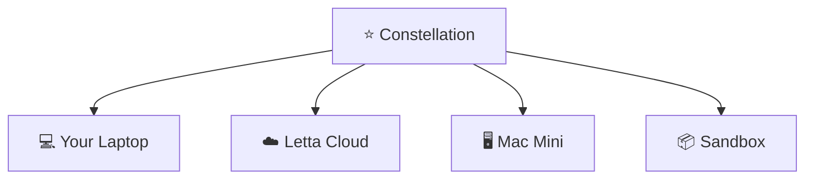

# Letta Code

[](https://www.npmjs.com/package/@letta-ai/letta-code) [](https://discord.gg/letta)

Letta Code is a memory-first coding harness, designed for long-lived agents that can learn from experience and maintain a cohesive identity across models (Claude, GPT, Gemini, GLM, Kimi, and more). Agents automatically reconfigure themselves through updating their skills, memory, and system prompt to adapt what they know and how they act. 

You can interact with Letta Code agents through:
* A local [**CLI**](https://docs.letta.com/letta-code/cli)
* The [**desktop app**](https://docs.letta.com/letta-code/desktop-app) for MacOS, Windows, and Linux
* Your browser, including [mobile](https://docs.letta.com/letta-code/remote-mobile), at [chat.letta.com](https://chat.letta.com)
* Messaging integrations, including Telegram, Slack, WhatsApp, and custom connectors


## Feature Overview 
> [!TIP]
> Letta Code agents are designed to be self-configuring. If you want to configure something (e.g. skills, behavior, hooks, permissions), try asking your agent to do it for you. 

| Feature | Description |
|---|---|
| [Self-improvement](https://docs.letta.com/letta-code/self-improvement) | Agents programmatically rewrite themselves to improve their own memory, prompting, and skills |
| [Message search](https://docs.letta.com/letta-code/conversation-search) | Search across all messages and agents with `/search` or ask your agent to |
| [MemFS](https://docs.letta.com/letta-code/memfs) | All context (including [memory blocks](https://www.letta.com/blog/memory-blocks)) are tracked via git. Sync context to a custom GitHub repository by setting `/memory-repository set git@github.com:...` |
| [Skills](https://docs.letta.com/letta-code/skills) | Loads global skills (`~/.letta`), project-scoped skills (`.agents/skills`), and agent-scoped skills (stored in MemFS) |
| [Subagents & Multi-agent](https://docs.letta.com/letta-code/subagents) | Call built-in subagents (general-purpose, forked, recall, history-analyzer) async or sync. Agents can all any other agent (including themselves) as subagents  |
| [Remote & Multi-Env](https://docs.letta.com/letta-code/client-server-architecture) | Agents work across multiple environments. Make any machine available as a remote environment by running `letta server --env-name "..."`|
| [Agent messaging](https://docs.letta.com/letta-code/agent-messaging) | Chat with the same agent from Slack, Telegram, your browser (chat.letta.com) including mobile, and through custom channels |
| [Hooks](https://docs.letta.com/letta-code/hooks) | Configure deterministic code to run on certain events |
| [Permissions](https://docs.letta.com/letta-code/permissions) | Customize what actions are auto-approved or auto-denied. |
| [Secrets](https://docs.letta.com/letta-code/secrets) | Make secrets available as environment variables (across machines) while obfuscating their values from context |
| [Crons/Schedules](https://docs.letta.com/letta-code/scheduling) | Configure heartbeats of crons, and let agents work across time with self-managed schedules |

See the full list of slash commands on our [documentation](https://docs.letta.com/letta-code/slash-commands). 

## Get started
Install the package via [npm](https://docs.npmjs.com/downloading-and-installing-node-js-and-npm):
```bash
npm install -g @letta-ai/letta-code
```
Navigate to your project directory and run `letta` (see command-line options [in the docs](https://docs.letta.com/letta-code/commands)).

On first run, choose how you want to start:

* **Proceed locally** keeps agent state on this device. This is the local-first path and does not require a Constellation login.
* **Login to Constellation** syncs agent state through the Constellation so you can access the same agents from `chat.letta.com`, the desktop app, other machines, and messaging integrations.

Run `/connect` to configure your own LLM API keys (OpenAI / ChatGPT, Anthropic, zAI coding plan, etc.), and use `/model` to swap models.

You can also download the [**desktop app**](https://docs.letta.com/letta-code/desktop-app) for MacOS, Windows, and Linux. Agents created in the CLI are available via the desktop app, and vice versa.

## Local mode
Local mode runs an embedded Letta-compatible backend inside Letta Code. Agents, conversations, memory, provider connections, and secrets are stored on your machine.

> [!TIP]
> Running Letta Code locally used to be require running a seperate Docker server. This is no longer required, as Letta Code now has a built-in embedded server.

Local mode is a good fit when you want:

* A self-contained agent runtime for local projects
* Disposable agents for experiments or development
* Inspectable state stored as ordinary local files
* Local git-backed MemFS memory
* Direct provider connections from your machine

Local mode means local **state**, not necessarily local **inference**. If you connect a remote provider like OpenAI, Anthropic, Gemini, OpenRouter, Bedrock, or ChatGPT/Codex, prompts still go to that provider. For a fully local loop, connect a local inference provider like Ollama, LM Studio, or llama.cpp.

You can enter local mode from the first-run setup menu, or explicitly with:

```bash
letta --backend local
```

Connect a provider from inside the TUI with `/connect`, or from the shell with `letta --backend local connect`:

```bash
letta --backend local connect anthropic --api-key "$ANTHROPIC_API_KEY"
letta --backend local connect ollama
letta --backend local connect lmstudio
letta --backend local connect llama-cpp
letta --backend local connect chatgpt
```

Then create a local agent:

```bash
letta --backend local --new-agent --model anthropic/claude-sonnet-4-6
```

Local backend state is stored by default in:

```text
~/.letta/lc-local-backend
```

You can override this location for isolated experiments:

```bash
export LETTA_LOCAL_BACKEND_DIR="$PWD/.letta-local"
letta --backend local --new-agent
```

Local agents do not appear in the Constellation, but their memory is still a normal git repository under `~/.letta/lc-local-backend/memfs/<agent-id>/memory`.

## Constellation
Constellation decouples where your agent *runs* from where you *interact* with your agent. Agents in the Constellation can be accessed from the CLI, desktop app, browser, or mobile, and run on any connected environment (locally, on Letta Cloud, or any machine you connect). 



### Remote environments
Any machine can be connected to Constellation by running: 
```bash
letta server
letta server --env-name "work-laptop"
```
Once a machine is connected, you can set it as an environment for your agent to run on whenever interacting with your agent. 

## Agent Memory & Learning
If you’re using Letta Code for the first time, you will likely want to run the `/init` command to initialize the agent’s memory system:
```bash
> /init
```

Over time, the agent will update its memory as it learns. To actively guide your agents memory, you can use the `/remember` command:
```bash
> /remember [optional instructions on what to remember]
```
Letta Code works with skills (reusable modules that teach your agent new capabilities in a `.skills` directory), but additionally supports [skill learning](https://www.letta.com/blog/skill-learning). You can ask your agent to learn a skill from its current trajectory with the command: 
```bash
> /skill [optional instructions on what skill to learn]
```
Read the docs to learn more about [skills and skill learning](https://docs.letta.com/letta-code/skills).


## Messaging Integrations
Letta Code supports [channels](https://docs.letta.com/letta-code/channels). 
```bash
letta channels configure telegram
letta server --channels telegram
```

Community maintained packages are available for Arch Linux users on the [AUR](https://aur.archlinux.org/packages/letta-code):
```bash
yay -S letta-code # release
yay -S letta-code-git # nightly
```

---

Made with 💜 in San Francisco
