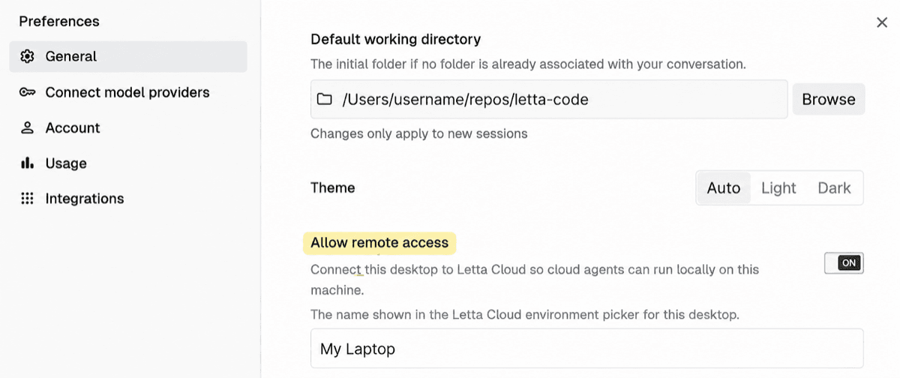

# Connect a computer for remote access

Use this guide when the user is connecting a computer for the first time, no suitable computers are listed, or their local machine cannot be reached.

Explain that the user must complete setup **on the computer they want to connect**, signed into the same Letta account they use on chat.letta.com. Remote access lets agents run commands and access files on that machine, subject to tool approvals. Local-only / “Skip login” mode is not sufficient.

Recommend Desktop for a personal computer; offer the CLI for a terminal-only machine or VM. Give the relevant steps below rather than only saying the computer is unavailable. Do not run registration commands in the Cloud sandbox as a substitute for connecting the user's machine.

## Option 1: Letta Desktop

Ask the user to:

1. [Download and install Letta Desktop](https://docs.letta.com/quickstart/) for their operating system.
2. Open the app and sign in to their Letta account.
3. Open **Preferences → General** and enable **Allow remote access**.
4. Set the computer's name in the field beneath the toggle.
5. Keep Desktop running and the computer awake and connected to the internet.
6. Open chat.letta.com and select the named computer in the computer picker to run a conversation there.

Show the bundled screenshot when explaining the toggle and name field:



Resolve `assets/allow-remote-access-from-desktop.png` relative to this skill's directory. In chat or Desktop, use the resolved absolute local path in the Markdown image you send, not this reference file's relative path. The screenshot is from the original teleportation skill; surrounding settings may differ in newer Desktop versions.

## Option 2: CLI server

Ask the user to install [Node.js 22.19 or newer](https://nodejs.org/en/download), then run these commands in a terminal **on the target computer**:

```bash
npm install -g @letta-ai/letta-code
letta server --computer-name "work-laptop"
```

If not already authenticated, the server prints a login URL. Ask the user to open it in a browser and authorize with their Letta account. Do not ask them to paste credentials into chat.

Keep the server process running and the computer awake and online. The named computer will appear in the picker on chat.letta.com or Desktop. For an always-on VM, use a service manager and persist the CLI's authentication state across restarts.

No inbound ports, public IP, or reverse proxy are required: the server connects outward to Letta Cloud. Use plain `letta server`, not `letta server --listen`; `--listen` starts the separate App Server interface for direct application connections.

## Verify access or reconnect an existing computer

After the user completes setup, run:

```bash
letta teleport list
```

Use the returned computer name or ID for remote delegation or teleportation. Do not claim access is ready until the desired computer is listed. Keep the current conversation in place unless the user wants to move it; remote subagents can work there while the parent stays in Cloud.

If the computer is still missing or unreachable, ask the user to check that:

- The computer is awake and connected to the internet.
- Desktop is open with **Allow remote access** enabled, or `letta server` is still running.
- The app or CLI is signed into the same Letta account as the web session.

Re-list after the user changes the relevant state, rather than repeatedly retrying an unavailable target. If it is listed but an operation still fails, use the concrete error to diagnose authentication, connectivity, or version compatibility; do not assume it needs reinstalling or bypass access controls.

For current installation details, consult the [machine setup docs](https://docs.letta.com/platform/computers/byom/). Verify CLI flags with `letta server --help` if docs and the installed version disagree.
